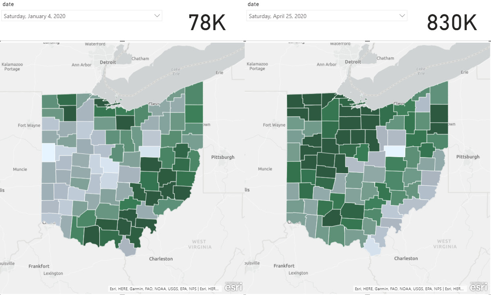
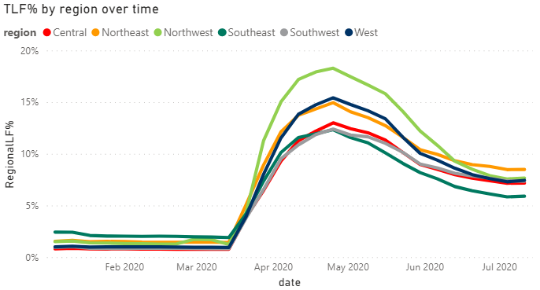

## Background

2020 has been an interesting year. Politics aside, public health and safety has taken the spotlight. While Public Health and Medical experts pore through the scientific side of things to development treatments and ways to stem the spread, others have been more focused on how to keep the economy afloat in the interim. Working in a rural community, real-time economic data is often hard to obtain. I typically rely on figures that are three months to an entire year old by the time the government source has released the data to the public. With unemployment numbers skyrocketing, that data started to be released with only about a week's delay. That data suddenly became a top source for digging into how pockets of the state were faring with the stay-at-home orders being put into place across the state.

## Data Gathering

The state of Ohio has a website listing historical unemployment data. Unfortunately, while downloadable, the file format is PDF. While [`tabula-py`](https://github.com/chezou/tabula-py) is great for scraping from a PDF, the state's format needed some hefty cleaning. I contacted [Dr. Ani Ruhil](https://aniruhil.org) and we traded some tips on cleaning the dataset and getting it to run weekly for the releases. As always, [`pandas`](https://pandas.pydata.org/) proved to be a data nerd's best friend to structure the data.

{}
A slight disclaimer on the data here. This utilizes unemployment insurance claims, not the standard unemployment rates. In Ohio for the time frame discussed here, this only included W-2 workers, not those who may be self-employed or earning incomes in alternate ways. As such, take all the analysis and commentary below as *guesstimates*. Which as this was mostly being used for trend comparison, should™ be okay.
{}

## Data Visualizing

Next step was to throw the csv created above into Power BI to let it shine. I have never used Tableau before, but I imagine the two are similar. The ability to have all your data and visualization options in one tool that you can easily share with colleagues is such a time saver. It allows for a lot in terms of data investigation with a GUI, which is a nice change from Python code.

In Ohio, unemployment is typically higher in certain geographies. One of the first things I noticed when looking at this data was that suddenly the areas typically hit hardest by unemployment were on the low end of the scale. The image below shows claims data from January 2020 compared to April 2020.

The map from January shows counties in the Southeast portion of the state with the highest unemployment claims. While those areas are still feeling the effects, suddenly western and northern Ohio have much higher claim rates. Those with some industry knowledge in the United States might know that there's a pocket of automotive manufacturing that overlaps Northwest Ohio. The auto industry definitely took a hit in productivity, and employment, during this time frame. Southeast Ohio also has a number of companies that are part of the auto supply chain, but they also have a number in other manufacturing industries that seemed to be more resilient throughout the lock down stages. Maybe a better representation would be to compare different regions of the state over time to see how each was affected by the unemployment claims. Below, you can see how the Southeast region started with the highest overall rate and has, thus far, seemed to recover more quickly. Or, was able to hold off on being overly affected in the first place.

## Thoughts

As stated earlier, workforce data typically lags. So it will still be a few months before we start to see reports come out of the different Federal agencies to know what kind of effect there was on gross regional product and county-level jobs and establishments. For me, it was nice to finally see a positive come out of this. While there is very little to be excited about in 2020, this information seems to show that the economy here is a little more resilient than first thought. There have been concerns about diversification in rural areas, and while this region could certainly use some more of that, they have come a long way from that over-reliance on coal that caused economic woes years ago.
