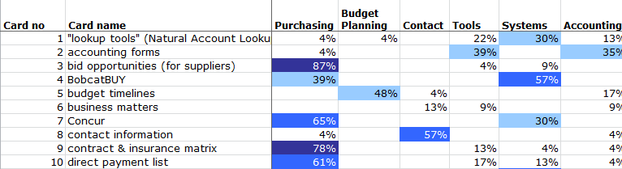
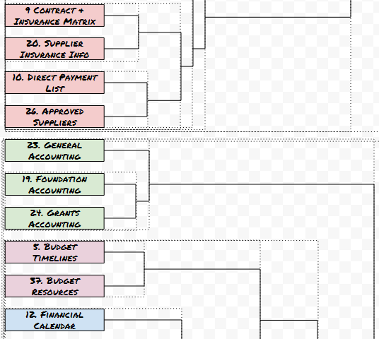
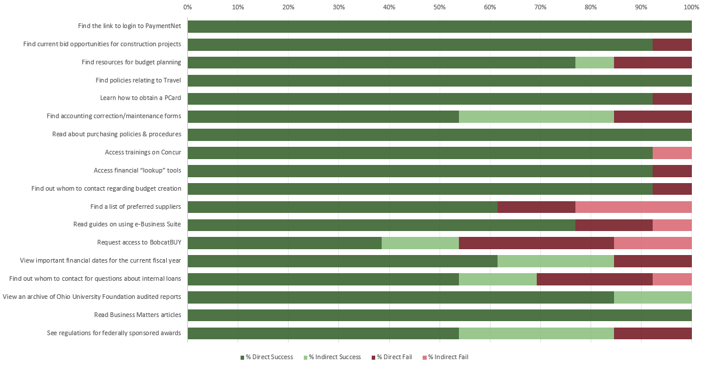
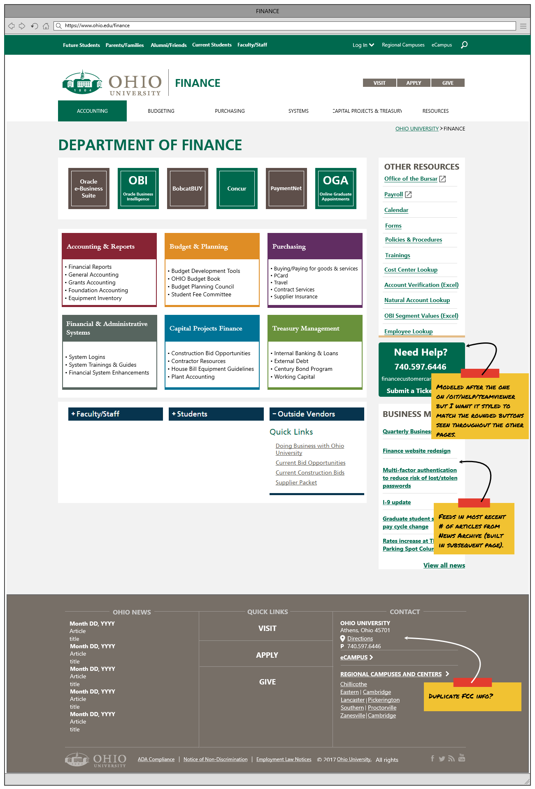
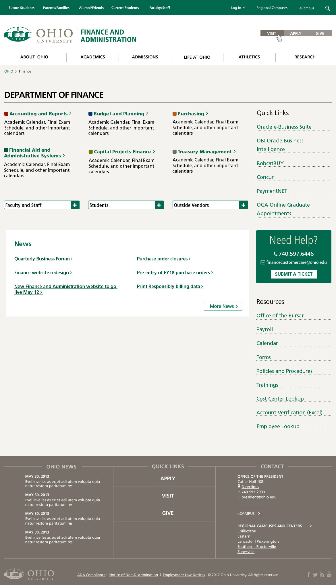
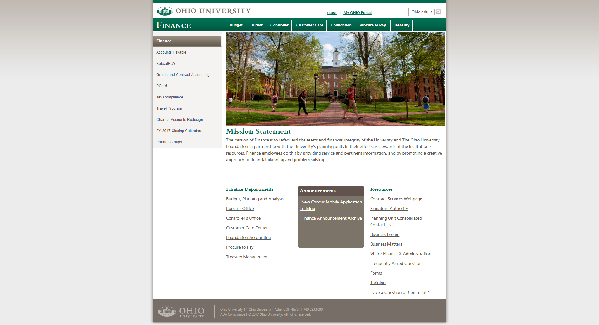
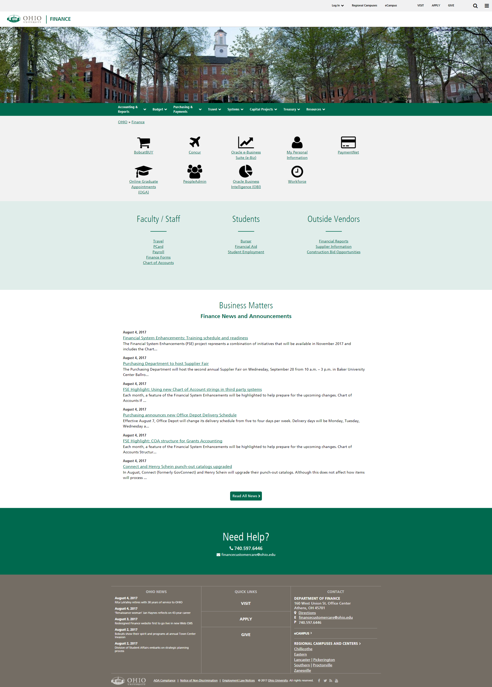

In 2016, Ohio University's Division of Finance and Administration approved a project to redesign three websites within their web presence. The main goals of the project were to modernize the overall appearance of the sites and make them more user-friendly and accessible. The project team included a communications specialist, change management assistance, graphic designers, and technological specialists. In addition, stakeholders from the impacted departments were involved from the beginning to ensure the site served internal needs as well as those of the customer base. My role on this team was to work with all parties involved to "modernize" the sites. This included updating the look and feel, streamlining content for various audiences, and working with departments on proper maintenance.

## Process

While the project encompassed sites for three different entities within the University, the process for redesign was similar for each case. For simplicity, this post will focus on the main Finance site process. For each site, an audit was completed of the department's current sitemap and file listing to give a high-level understanding of the items the department had available. Next, the communications and web specialists met with each department to understand their audience and their business objectives. This meeting had a few goals:

- Determine which items in the site audit could be discarded in the migration
- Categorize items based on intended audience
- Develop content workflows to start planning for navigation structure in the new site

In order to get audience feedback, I created a user survey that was then distributed campus-wide to see what items they found most important for their daily activities. The survey also asked users how well they were able to currently find specific items and information on the site as an attempt to test the current navigational structure. Following the surveys, a focus group of users was put together to ask more specific questions. During these focus group sessions, members were asked to complete a card sort. Topics within the task were taken directly from the survey as items users identified needing to find on a Finance website. Results of this sort were analyzed to find correlations among categories and information locations. This gave a final dendrogram that helped to drive where information would be located within the new site.

To validate the proposed navigational structure, I conducted one-on-one sessions with focus group participants to have them complete a tree test. I asked users to use the new navigation to show how they would go about finding specific topics of information. While the first round had items that proved difficult to find, a few tweaks to the navigation provided a navigational structure that seemed far more intuitive than the one initially in place.

Once the tree sort was completed, I created some mockups that were shared with the development team to implement as templates. Next, the University Communications and Marketing team had their graphic designers take a look and give a mockup for comparison.

The graphic designers met with the rest of the project team to finalize the most needed items on the site as well as the direction the University wanted to take with its brand appeal moving forward. The team was then able to come up with a new design that incorporated stakeholder and audience needs as well as act as a marketing tool for the University. Comparisons between the original site and the redesigned one can be seen at the end of this post.

## Implementation

With designs and research complete, content was able to be migrated into the sites. The project timeline overlapped with a shift in the CMS being used by the University. This meant working with the IT team on getting an instance of Drupal set up and usable. The new CMS allowed increased functionality within the site as a whole, leading to additions in content to the site. News feeds were given added tagging systems to be used by multiple offices as an announcements module. Staff listings separated by office were added with editors being able to add biographies and responsibilities at a later date if desired. In addition, JavaScript libraries were added to tables to add sorting and searching capabilities. The JS library also allows excess columns to "hide" as screen sizes shrink so that users are able to see the most useful information on page load.

By the end of the project, the Finance site had a new navigational structure. This included not only the menu levels, but also quick-access links to the most used items. The goal was to lower the amount of time, and clicks, for users to get to their content, alleviating stress and frustration as the most common users were other employees. I was also able to clean up years of unused files, both in terms of outdated files and those not used by the site's intended audience, and instruct staff members on best practices for web files to combat potential link breakages or file duplication. The images below show the before/after comparison. As the University was undergoing further website branding updates, click the header to be taken to the most up-to-date version of the site.

### [Finance](https://ohio.edu/finance-administration)

