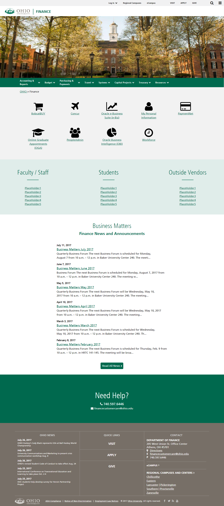
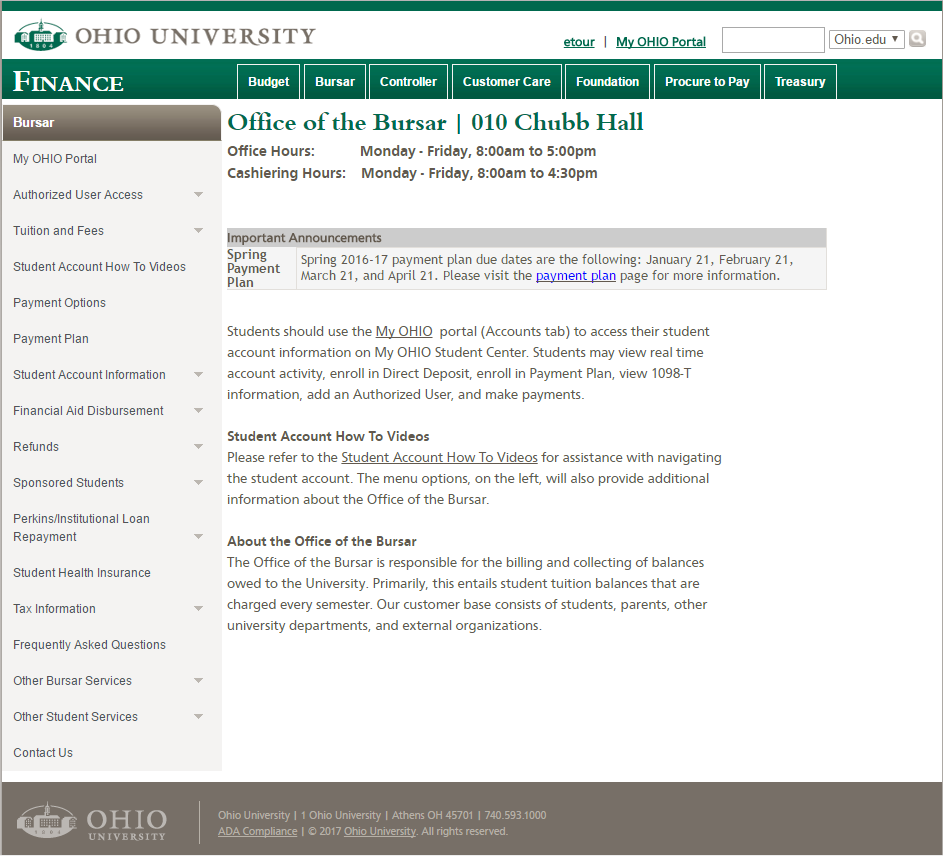
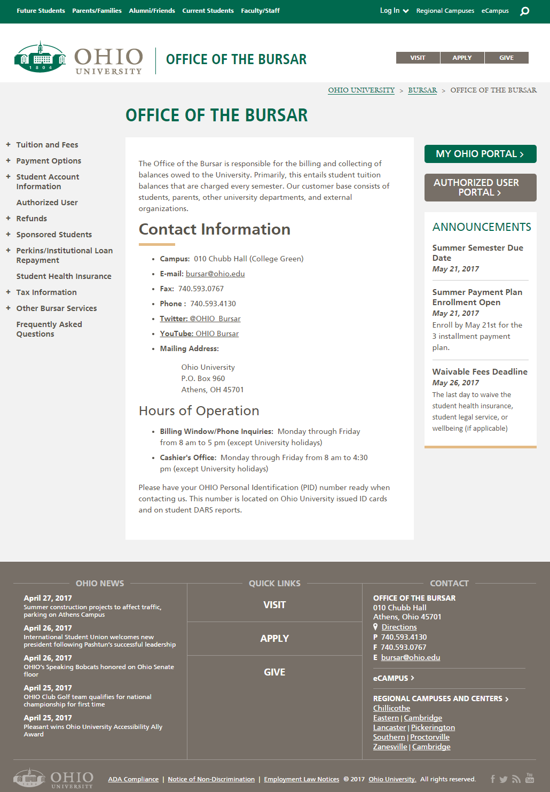
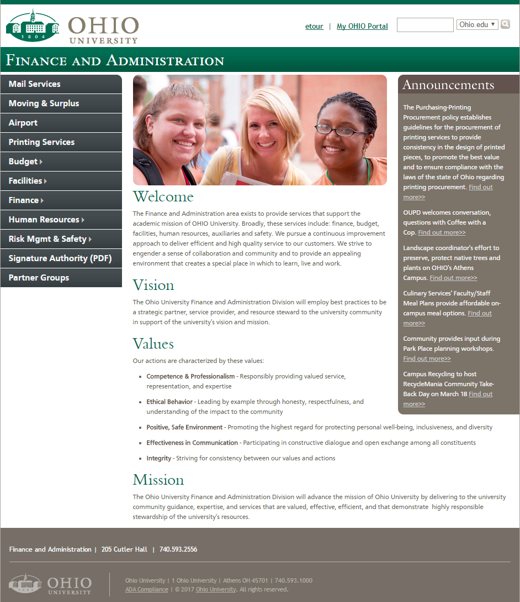
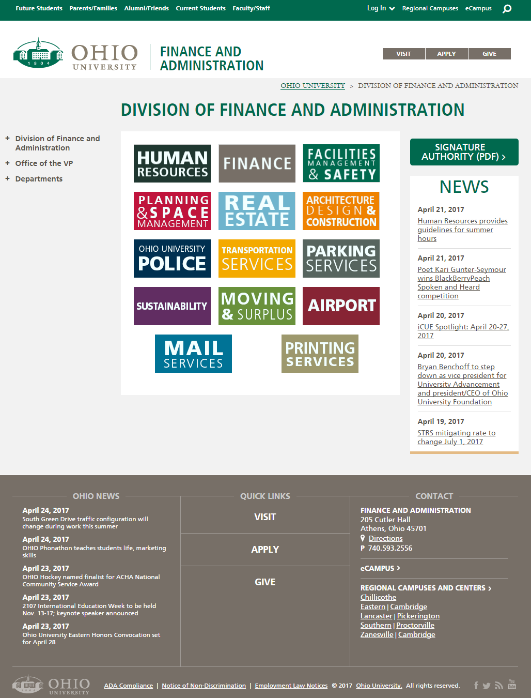

Ohio University's Division of Finance and Administration approved a project to redesign three websites within their web presence. The main goals of the project were to modernize the overall appearance of the sites and make them more user-friendly and accessible. The project team included a communications specialist, change management assistance, graphic designers, and technological specialists. In addition, stakeholders from the impacted departments were involved from the beginning to ensure the site served internal needs as well as those of the customer base.

## Role
As the Web Specialist on the project, my role was to ensure that the new sites met the needs of all parties involved. This meant ensuring the site was:
- Accessible
- Responsive
- User-friendly

While the above items would be mostly handled due to the University's use of a Content Management System (CMS), there were further requirements to meet based on the individual offices involved in the project.

## Process
Due to the differences in each site, the project was broken down into three phases - one for each site being redesigned. While there was some overlap in the timeline, this allowed the project team to focus on one business process at a time as each department's customer base differed greatly.

Despite the differences in each site, the overall process was similar. The project began by looking over an audit of the current site's sitemap and file listing to give a high-level understanding of the items the department had available. Next, the communications and web specialists met with each department to understand their audience and their business objectives. This allowed the team to know what items within the initial site audit needed to be kept in the migration as well as beging to develop ideas for the overall look and functionality of the new site based on the intended audience. For instance, one department involved in the project is more student-facing than the others and the template used for their new site was modeled heavily off other student-facing sites within the Universiy's web presence.

Next, the project moved into the information architecture phase. For the largest site in the project, Finance, this included a user survey to campus, as that was identified as the main audience, to see what items they found most important for their daily activities. The survey also asked users how well they were able to currently find specific items and information on the site as an attempt to test the current navigational structure. Following the surveys, a focus group of users was put together to ask more specific questions. During these focus group sessions, members were asked to complete a card sort. Topics within the task were taken directly from the survey as items users identified needing to find on a Finance website. Results of this sort were analyzed in both Excel and using R to find correlations among categories and information locations. This gave a final dendrogram that helped to drive where information would be located within the new site.

To validate the proposed navigational structure, one-on-one sessions were set up with focus group participants to have them complete a tree test. This asked users to use the new navigation to show how they would go about finding specfic topics of information. While the first round had a few items that proved difficult to find, a few tweaks to the navigation provided a navigational structure that seemed to prove far more intuitive than the one initially in place.

During the navigation vetting, designs were being created to incorporate the requirements from stakeholders. Sketched wireframes had been completed prior to finalizing the navigation to get a block layout as a template for multiple pages. Once the tree sort was completed, colored mockups were created to incorporate the need for an additional resources location - an item determined necessary because of the tree sort. Once these were delivered to the development team to implement as templates, the University Communications and Marketing team had their graphic designers take a look and give a mockup for comparison.

The graphic designers met with the rest of the project team to finalize the most needed items on the site as well as the direction the University wanted to take with its brand appeal moving forward. The team was then able to come up with a new design that incorporated stakeholder and audience needs as well as act as a marketing tool for the University.

## Implementation
With designs and research complete, content was able to be migrated into the sites. For the first two sites in the project, this included creating the new pages within CommonSpot and documenting the process to train future editors on maintaining the site. All items added to these new pages were implemented with open permissions so that editors would be able to tweak content as their needs changed.

For the Finance website, the project timeline overlapped with a shift in the CMS being used by the University. This meant working with the IT team on getting an instance of Drupal set up and usable. The new CMS allowed increased functionality within the site as a whole, leading to additions in content to the site. News feeds were given added tagging systems to be used by multiple offices as an annoucements module. Staff listings separated by office were added with editors being able to add biographies and responsibilites at a later date if desired. In addition, JavaScript libraries were added to tables to add sorting and searching capabilities. The JS library also allows excess columns to "hide" as screen sizes shrink so that users are able to see the most useful information on page load.

## Before/After Comparisons
The redesign included sites for three entities within the University. Click on each department name below to be taken to the current version of the site.

### 
[Office of the Bursar](https://ohio.edu/bursar)

### [Division of Finance and Administration](https://ohio.edu/finance-administration)

### [Finance](https://ohio.edu/finance-administration)

