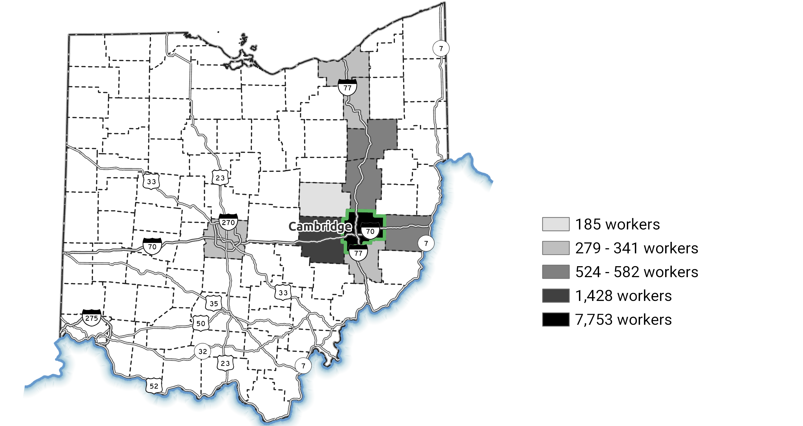

## Should I Stay or Should I Go?

The region I live and work in is considered rural. While there are cities dotted around with malls and entertainment options, the average person is not heading to the grocery store on foot. For many, heading to town to stock up on items once a week is the norm. While this has implications for quality of life on a private level, it also has an impact on people's professions as well. If it takes you 30 minutes to get to town to do your shopping, how far are you going to have to travel for decent work? How do you straddle the line between quality of life and quality of work?

I have personally experienced the situation above. Drive an hour-and-a-half one way for work to offer up more opportunities and collaboration or stick closer to where I want to live and spend my free time at the cost of fewer job opportunities? In my opinion, this is one area economic development can assist. Regional economies do best when they are diverse. This allows them to recover more quickly if an industry suddenly plummets. This can be clearly seen in [Appalachia America following the coal decline](https://wfpl.org/new-economic-data-show-appalachias-struggles-amid-coals-decline/). While the local economy tries to recover, many seek work elsewhere. I wanted to know where.

## Where Do All the Workers Go?

The [OnTheMap](https://onthemap.ces.census.gov/) tool from the United States Census Bureau allows for exploration of the posed question. While their tool allows for some significant analysis, I wanted more control over the output of the data. Since OnTheMap is a Census tool, the data driving it was available for download. The structure leaves a little to be desired, though, due to the sheer size of it all. Thanks to their FTP site and consistent folder structure, I was able to write code to download the entire 2015 data set (recently updated for their 2017 release), merge the files, and restructure them to keep the relevant information for the state of Ohio.

Within Ohio, it seems that no matter where you live, people travel to Columbus to work. Many companies seem to gravitate toward huge urban centers as it allows them to tap into a larger workforce and have more nearby amenities. Because of this, I decided to center my search around MSAs. Ohio itself has many of these, but given my region's proximity to Pennsylvania and West Virginia, I wanted to include their nearest MSAs as well.

Looking into the numerical side of the analysis, the numbers were staggering. Out of a 25 county region in Southeastern Ohio, nearly 100,000 people leave to work within a major metro area. That amounts to over 25% of the workers in the region going elsewhere for employment. Clearly a significant portion of our workforce travels outside of the region to bring home the bacon. But in order to really tell others *where* the workforce is going, I made the map at the top of the page.

And let's be honest, it was also a way for me to put together all the things I had been learning within ArcGIS Pro in the past year. I really enjoy the minimalist approach to data visualization. Let the background information be just that — background. The other counties outside my region stay white with just enough bordering to let you know they are counties. The roads are important because it shows the obvious pathways to the metro areas, but still secondary to the number of workers leaving the region. The highlights are the vast number of people going to each area as well as the counties they are coming from. I need to include a disclaimer on the shading for the counties. As the legend states, shading is done based on overall number of workers within each county traveling to the designated MSAs. On a choropleth map, you typically want to stick with depicting normalized data. In other words, I should have converted the numbers to the *percentage of workers* traveling from each county. In data visualization, though, audience matters. In the end, I made this for a regional economic development organization. We want to be able to show this to a company who is worried about workforce numbers and say, "All these people travel a long way to get to work each day. With the right job and competitive wages, they would probably want to be closer to home."

## Let's Get Curious!

Geospatial analysis allows for a clearer picture of what is happening when we talk about commuting patterns. It's one thing to take a county and list the numbers of workers out-commuting and to which county. It's much clearer to *map* that same data.

In the example above, I looked into Guernsey county workers. The top ten workplaces are shaded on the map. This time, as we are only looking at Guernsey county's workforce instead of a comparison set of counties, there is no need to normalize the data. In this case, the highways act as an added piece of the analysis instead of just background graphics. We can see that the workforce trickles off along Interstate 77. If that Highway were not there, the commuting patterns would likely differ. The same is true for Interstate 70 taking people west to Columbus. Doing this for more of our counties will allow us to have a better grasp of how our workforce likely travels. For instance, if a company is considering locating nearby Interstate 77 in one of our counties, we might be able to say something along the lines of "X people drive past here for work already." Insinuating that maybe they could stop at the new location instead.

With the data cleaned, I am already looking ahead to what else can be done with it. The dataset allows me to look at workforce clear to the census block level. This will allow more investigation into questions such as, "workforce within X minutes from the site," which are common in economic development. I think it could also lead to conversations with Ohio Department of Transportation folks. While they have data about number of travelers on highways already, looking into data at the workforce level could show patterns of folk who seem to go gravitate toward working in one area instead of another simply due to ease of transportation. In the image above, for example, counties southeast of Guernsey do not show up in the top 10 work locations likely due to travel options. Roadways in that direction are curvy, two-lane state highways that are not as easy to traverse on a daily basis.
